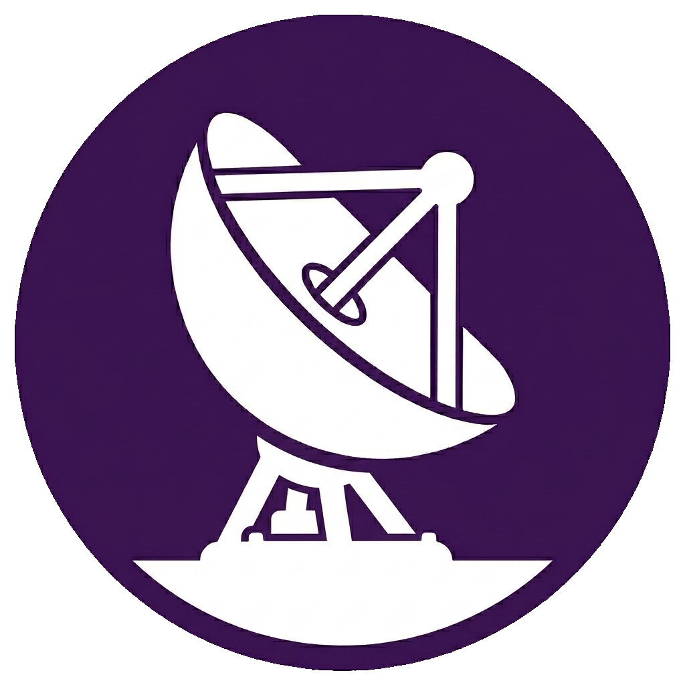

<div align="center">
  
</div>

# datalink

`datalink` is a Rust aviation datalink workspace with a reusable decode library and a
single CLI for demodulating and decoding aviation datalink traffic.

- `crates/acars` — core library for ACARS, VDL2 AVLC, ADS-C, CPDLC-related payloads,
  HFDL PDU parsing, and optional demodulators.
- `crates/datalink` — CLI application for bearer frontends, standalone frame decoding, Airframes.io input, Redis/JSONL output, and merged receiver configurations.

`datalink` can decode standalone frames, demodulate VDL2 / VHF ACARS / HFDL I/Q sources,
consume Airframes.io websocket events, run merged TOML receiver configurations, and emit
JSONL or Redis pub/sub output.

## CLI overview

```text
datalink [--config datalink.toml] [COMMAND]
```

Commands:

```text
vdl2          VDL Mode 2 frontend for I/Q and SDR inputs
vhf           Classic VHF ACARS frontend
airframes.io  Airframes.io websocket feed
hfdl          HF Data Link frontend
decode        Decode standalone payloads or frames
```

When no subcommand is provided, `datalink` runs merged receiver mode and expects
`--config <FILE>`.

### Standalone decode examples

```sh
# Decode an ACARS frame from hex
datalink decode acars --direction downlink '<hex>'

# Decode an AVLC frame including FCS bytes
datalink decode avlc '<hex>'

# Decode an ARINC 622 app envelope (ADS-C, CPDLC, DIS, or raw IMI payloads)
datalink decode arinc622 --direction downlink '/ATSU.ADS....'
datalink decode arinc622 --direction uplink '/ATSU.AT1....'

# Decode strict ADS-C or CPDLC ARINC 622 envelopes
datalink decode adsc --direction uplink '/ATSU.ADS....'
datalink decode cpdlc --direction uplink '/ATSU.AT1....'
```

### VDL2 frontend

```sh
datalink vdl2 --format cu8 --sample-rate 1050000 --center-freq 136850000 \
  --channel 136875000 136975000 file://capture.cu8
```

Useful options:

- `--output <file>` — write decoded JSONL in addition to stdout.
- `--stats` — print demod/decode counters.
- `--redis-url <url>` — publish decoded records to application-specific Redis topics.

### Classic VHF ACARS frontend

```sh
datalink vhf --format cu8 --sample-rate 1050000 --center-freq 131700000 \
  --channel 131525000 131725000 file://capture.cu8
```

Useful options:

- `--output <file>` — write decoded JSONL in addition to stdout.
- `--stats` — print demod/decode counters.
- `--redis-url <url>` — publish decoded messages to application-specific Redis topics.

### HFDL frontend

```sh
datalink hfdl --format cf32 --center-freq 10000000 --sample-rate 8000000 \
  --max-seconds 20 file://capture.cf32
```

Useful options:

- `--stats` — print demod/decode counters.
- `--redis-url <url>` — publish decoded PDUs to application-specific Redis topics.

For SDRUno-style 16-bit stereo WAV I/Q files, `.wav` input is auto-detected when
`--format` is omitted:

```sh
datalink hfdl --max-seconds 60 file://HFDL_10081kHz.wav
```

Redis publishing uses application-specific topics across all bearers, for example
`datalink-sq`, `datalink-acars`, `datalink-cpdlc`, and `datalink-other`.

### Source URLs

VDL2, VHF, and HFDL share the same source direction: WAV I/Q recordings, raw I/Q recordings,
and live SDR sources.

VDL2 and VHF currently accept:

- `file://...` or a bare file path
- `-` for stdin
- `rtlsdr://...` when built with `rtlsdr`
- `airspy://...` when built with `airspy`
- `hackrf://...` when built with `hackrf`
- `soapy://...` when built with `soapy`

Common source query parameters include `format`, `center_freq`/`freq`,
`sample_rate`/`rate`, `channel`/`channels`, `gain`, `bias_tee`, and device-specific gain
settings. If `gain` is omitted, datalink applies its per-device default; `gain=auto`
explicitly requests device automatic gain control where supported. HackRF accepts
`amp_enable`/`rf_amp` for its 14 dB RF amplifier plus `lna_gain`/`if_gain` and
`vga_gain`/`bb_gain` for stage gains.

For file captures, `datalink` can infer center frequency, sample rate, and `cf32` format
from Gqrx-style filenames such as `gqrx_20260518_114025_136500000_1800000_fc.raw`. It can
also infer center frequency from SDRUno-style names containing a trailing `kHz` frequency.

## Library notes

The `acars` crate is the reusable decode library. Its demodulators are behind the optional
`demod` feature so pure parser users do not need to pull in SDR/DSP dependencies.

- Default `acars` build: decode/parsing only.
- `acars` with `features = ["demod"]`: adds VDL2, VHF ACARS, and HFDL demod support.

The `datalink` CLI enables `acars/demod` because it includes demodulating frontends. See
`crates/acars/readme.md` for the library API overview until the crate is published on docs.rs.

## Cargo features

`datalink` defaults to SDR and websocket support:

```text
default = ["rtlsdr", "airspy", "hackrf", "websocket"]
```

Individual SDR features can be disabled or selected with normal Cargo feature flags.

## Project direction

The project is Rust-native rather than a direct port of an existing decoder. The goal is a
shared Rust library plus a consistent JSON-facing CLI across VDL2, VHF ACARS, HFDL, and
external event sources, following the relevant datalink standards and preserving unknown
or vendor-specific payloads for later analysis.
